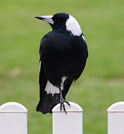
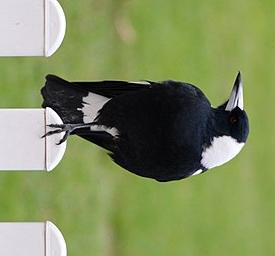
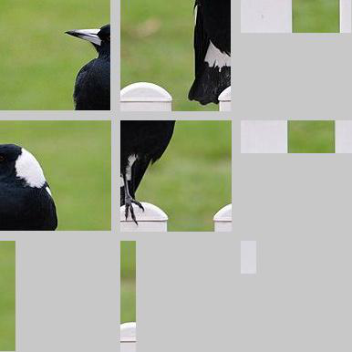

<!-- README.md is generated from README.Rmd. Please edit that file -->

# btnvips 

<!-- badges: start -->


<!-- badges: end -->

`btnvips` is an Rstats interface to
[libvips](https://libvips.github.io/libvips/) on the command line.

Using `btnvips` the user can construct and execute `vips` on the command
line in a programmatic way.

The **btn** in `btnvips` is pronounced “*button*” and stands for “better
than nothing”.`btnvips` is a part of the ButtonVerse.

### Features

  - Anything(?) you can do in command line vips, you can do in `btnvips`
  - Support for all \~270 commands
  - Tab-completion for command arguments
  - Sanity checks for calling syntax

### Installation

You can install `btnvips` from
[github](https://github.com/coolbutuseless/btnvips) with:

``` r
# install.packages("remotes")
# install.packages(c('R6', 'glue'))
remotes::install_github("coolbutuseless/btnsystem")
remotes::install_github("coolbutuseless/btnvips")
```

### Design choices:

The interface mimics the vips command line very closely with direct
1-to-1 translations of all the command line arguments. This is by
design, so that

  - if you’re familiar already with vips on the command line, using
    `btnvips` should make some sort of sense
  - users should refer to [libvips
    documentation](https://libvips.github.io/)

### Limitations/Notes

  - `btnvips` is really just a glorified called to `system2()`
  - If you’re not familiar with `libvips` on the command line, this
    package isn’t really going to help you learn
  - There is no functionality within `btnvips` for viewing images. This
    is currently because `libvips` itself isn’t an image viewer.

## Example image

An example image is included in the package. Because `vips` on the
command line has no facility for actually *viewing* images, this
vignette will use the `magick` package to read images into R and display
them.

``` r
im_filename <- system.file("img", "magpie.jpg", package = 'btnvips')
im <- magick::image_read(im_filename)
im
```



## Example: Rotate an image

This is a basic example which shows you how to rotate an image with
`vips`

``` r
#~~~~~~~~~~~~~~~~~~~~~~~~~~~~~~~~~~~~~~~~~~~~~~~~~~~~~~~~~~~~~~~~~~~~~~~~~~~~~
# Load vips, create a new object and ask for help on the 'rot' command
#~~~~~~~~~~~~~~~~~~~~~~~~~~~~~~~~~~~~~~~~~~~~~~~~~~~~~~~~~~~~~~~~~~~~~~~~~~~~~
library(btnvips)
v <- Vips$new()
v$help('rot')
```

``` 
   rotate an image
   usage:
      rot in out angle [--option-name option-value ...]
   where:
      in           - Input image, input VipsImage
      out          - Output image, output VipsImage
      angle        - Angle to rotate image, input VipsAngle
            default: d90
            allowed: d0, d90, d180, d270
```

``` r
#~~~~~~~~~~~~~~~~~~~~~~~~~~~~~~~~~~~~~~~~~~~~~~~~~~~~~~~~~~~~~~~~~~~~~~~~~~~~~
# Decide on the output file location
#~~~~~~~~~~~~~~~~~~~~~~~~~~~~~~~~~~~~~~~~~~~~~~~~~~~~~~~~~~~~~~~~~~~~~~~~~~~~~
tmp <- tempfile(fileext = ".jpg")

#~~~~~~~~~~~~~~~~~~~~~~~~~~~~~~~~~~~~~~~~~~~~~~~~~~~~~~~~~~~~~~~~~~~~~~~~~~~~~
# Create the command and view what it is going to do on the command line
#~~~~~~~~~~~~~~~~~~~~~~~~~~~~~~~~~~~~~~~~~~~~~~~~~~~~~~~~~~~~~~~~~~~~~~~~~~~~~
v$rot(in_ = im_filename, out = tmp, angle = 'd90')
v
```

``` 
   vips rot   \
   /Library/Frameworks/R.framework/Versions/3.6/Resources/library/btnvips/img/magpie.jpg   \
   /var/folders/5p/78cv9fvn4xn_rbgxpx51q5n80000gn/T//RtmpWHSaSl/file181d035c4f2e2.jpg d90
```

``` r
#~~~~~~~~~~~~~~~~~~~~~~~~~~~~~~~~~~~~~~~~~~~~~~~~~~~~~~~~~~~~~~~~~~~~~~~~~~~~~
# Run the command.
#~~~~~~~~~~~~~~~~~~~~~~~~~~~~~~~~~~~~~~~~~~~~~~~~~~~~~~~~~~~~~~~~~~~~~~~~~~~~~
v$run()

#~~~~~~~~~~~~~~~~~~~~~~~~~~~~~~~~~~~~~~~~~~~~~~~~~~~~~~~~~~~~~~~~~~~~~~~~~~~~~
# View the file using image magick 
#~~~~~~~~~~~~~~~~~~~~~~~~~~~~~~~~~~~~~~~~~~~~~~~~~~~~~~~~~~~~~~~~~~~~~~~~~~~~~
magick::image_read(tmp)
```



## Example: Save a Deep Zoom image

``` r
#~~~~~~~~~~~~~~~~~~~~~~~~~~~~~~~~~~~~~~~~~~~~~~~~~~~~~~~~~~~~~~~~~~~~~~~~~~~~~
# Create a new Vips object and a nominate a place to put the Deep Zoom images
#~~~~~~~~~~~~~~~~~~~~~~~~~~~~~~~~~~~~~~~~~~~~~~~~~~~~~~~~~~~~~~~~~~~~~~~~~~~~~
v <- Vips$new()
# v$help('dzsave')
dzi_root <- tempfile()
dzi_dir <- paste0(dzi_root, "_files/")

#~~~~~~~~~~~~~~~~~~~~~~~~~~~~~~~~~~~~~~~~~~~~~~~~~~~~~~~~~~~~~~~~~~~~~~~~~~~~~
# Create the command for converting input to a deep zoom image
#~~~~~~~~~~~~~~~~~~~~~~~~~~~~~~~~~~~~~~~~~~~~~~~~~~~~~~~~~~~~~~~~~~~~~~~~~~~~~
v$dzsave(in_ = im_filename, filename = dzi_root, tile_size = 120, depth = 'onetile', centre = TRUE)
v
```

``` 
   vips dzsave   \
   /Library/Frameworks/R.framework/Versions/3.6/Resources/library/btnvips/img/magpie.jpg   \
   /var/folders/5p/78cv9fvn4xn_rbgxpx51q5n80000gn/T//RtmpWHSaSl/file181d01425bcbe   \
   --tile-size 120 --depth onetile --centre
```

``` r
#~~~~~~~~~~~~~~~~~~~~~~~~~~~~~~~~~~~~~~~~~~~~~~~~~~~~~~~~~~~~~~~~~~~~~~~~~~~~~
# Run the command.
#~~~~~~~~~~~~~~~~~~~~~~~~~~~~~~~~~~~~~~~~~~~~~~~~~~~~~~~~~~~~~~~~~~~~~~~~~~~~~
v$run()

#~~~~~~~~~~~~~~~~~~~~~~~~~~~~~~~~~~~~~~~~~~~~~~~~~~~~~~~~~~~~~~~~~~~~~~~~~~~~~
# List the files available in the Deep Zoom directory structures
#~~~~~~~~~~~~~~~~~~~~~~~~~~~~~~~~~~~~~~~~~~~~~~~~~~~~~~~~~~~~~~~~~~~~~~~~~~~~~
list.files(dzi_dir, recursive = TRUE)
```

``` 
    [1] "0/0_0.jpeg" "1/0_0.jpeg" "1/0_1.jpeg" "1/1_0.jpeg" "1/1_1.jpeg"
    [6] "2/0_0.jpeg" "2/0_1.jpeg" "2/0_2.jpeg" "2/1_0.jpeg" "2/1_1.jpeg"
   [11] "2/1_2.jpeg" "2/2_0.jpeg" "2/2_1.jpeg" "2/2_2.jpeg"
```

## Example: View a tileset of a Deep Zoom image

``` r
#~~~~~~~~~~~~~~~~~~~~~~~~~~~~~~~~~~~~~~~~~~~~~~~~~~~~~~~~~~~~~~~~~~~~~~~~~~~~~~
# For this Deep Zoom tileset, select all the images at Depth = 2 
#~~~~~~~~~~~~~~~~~~~~~~~~~~~~~~~~~~~~~~~~~~~~~~~~~~~~~~~~~~~~~~~~~~~~~~~~~~~~~~
depth_2_images <- list.files(file.path(dzi_dir, 2), recursive = TRUE, full.names = TRUE)
tmp_combined   <- tempfile(fileext = ".jpg")

#~~~~~~~~~~~~~~~~~~~~~~~~~~~~~~~~~~~~~~~~~~~~~~~~~~~~~~~~~~~~~~~~~~~~~~~~~~~~~~
# Create a command for joining all the images.
#~~~~~~~~~~~~~~~~~~~~~~~~~~~~~~~~~~~~~~~~~~~~~~~~~~~~~~~~~~~~~~~~~~~~~~~~~~~~~~
v$arrayjoin(in_ = vips_array(depth_2_images), out = tmp_combined, 
            across = 3, background = vips_array(c(200, 200, 200)), shim = 10)

#~~~~~~~~~~~~~~~~~~~~~~~~~~~~~~~~~~~~~~~~~~~~~~~~~~~~~~~~~~~~~~~~~~~~~~~~~~~~~~
# View the command we're about to run
#~~~~~~~~~~~~~~~~~~~~~~~~~~~~~~~~~~~~~~~~~~~~~~~~~~~~~~~~~~~~~~~~~~~~~~~~~~~~~~
v 
```

``` 
   vips arrayjoin   \
   /var/folders/5p/78cv9fvn4xn_rbgxpx51q5n80000gn/T//RtmpWHSaSl/file181d01425bcbe_files//2/0_0.jpeg   \
   /var/folders/5p/78cv9fvn4xn_rbgxpx51q5n80000gn/T//RtmpWHSaSl/file181d01425bcbe_files//2/0_1.jpeg   \
   /var/folders/5p/78cv9fvn4xn_rbgxpx51q5n80000gn/T//RtmpWHSaSl/file181d01425bcbe_files//2/0_2.jpeg   \
   /var/folders/5p/78cv9fvn4xn_rbgxpx51q5n80000gn/T//RtmpWHSaSl/file181d01425bcbe_files//2/1_0.jpeg   \
   /var/folders/5p/78cv9fvn4xn_rbgxpx51q5n80000gn/T//RtmpWHSaSl/file181d01425bcbe_files//2/1_1.jpeg   \
   /var/folders/5p/78cv9fvn4xn_rbgxpx51q5n80000gn/T//RtmpWHSaSl/file181d01425bcbe_files//2/1_2.jpeg   \
   /var/folders/5p/78cv9fvn4xn_rbgxpx51q5n80000gn/T//RtmpWHSaSl/file181d01425bcbe_files//2/2_0.jpeg   \
   /var/folders/5p/78cv9fvn4xn_rbgxpx51q5n80000gn/T//RtmpWHSaSl/file181d01425bcbe_files//2/2_1.jpeg   \
   /var/folders/5p/78cv9fvn4xn_rbgxpx51q5n80000gn/T//RtmpWHSaSl/file181d01425bcbe_files//2/2_2.jpeg   \
   /var/folders/5p/78cv9fvn4xn_rbgxpx51q5n80000gn/T//RtmpWHSaSl/file181d01a9d77f9.jpg   \
   --across 3 --shim 10 --background 200 200 200
```

``` r
#~~~~~~~~~~~~~~~~~~~~~~~~~~~~~~~~~~~~~~~~~~~~~~~~~~~~~~~~~~~~~~~~~~~~~~~~~~~~~~
# Run the command.
#~~~~~~~~~~~~~~~~~~~~~~~~~~~~~~~~~~~~~~~~~~~~~~~~~~~~~~~~~~~~~~~~~~~~~~~~~~~~~~
v$run()
```

``` r
magick::image_read(tmp_combined)
```



## All included vips commands

``` r
v <- Vips$new()
v$commands()
```

``` 
     [1] "system"                "add"                   "subtract"             
     [4] "multiply"              "divide"                "relational"           
     [7] "remainder"             "boolean"               "math2"                
    [10] "complex2"              "complexform"           "sum"                  
    [13] "invert"                "linear"                "math"                 
    [16] "abs"                   "sign"                  "round"                
    [19] "relational_const"      "remainder_const"       "boolean_const"        
    [22] "math2_const"           "complex"               "complexget"           
    [25] "avg"                   "min"                   "max"                  
    [28] "deviate"               "stats"                 "hist_find"            
    [31] "hist_find_ndim"        "hist_find_indexed"     "hough_line"           
    [34] "hough_circle"          "project"               "profile"              
    [37] "measure"               "getpoint"              "find_trim"            
    [40] "copy"                  "tilecache"             "linecache"            
    [43] "sequential"            "cache"                 "embed"                
    [46] "gravity"               "flip"                  "insert"               
    [49] "join"                  "arrayjoin"             "extract_area"         
    [52] "extract_area"          "smartcrop"             "extract_band"         
    [55] "bandjoin"              "bandjoin_const"        "bandrank"             
    [58] "bandmean"              "bandbool"              "replicate"            
    [61] "cast"                  "rot"                   "rot45"                
    [64] "autorot"               "ifthenelse"            "recomb"               
    [67] "bandfold"              "bandunfold"            "flatten"              
    [70] "premultiply"           "unpremultiply"         "grid"                 
    [73] "transpose3d"           "scale"                 "wrap"                 
    [76] "zoom"                  "subsample"             "msb"                  
    [79] "byteswap"              "falsecolour"           "gamma"                
    [82] "composite"             "composite2"            "black"                
    [85] "gaussnoise"            "text"                  "xyz"                  
    [88] "gaussmat"              "logmat"                "eye"                  
    [91] "grey"                  "zone"                  "sines"                
    [94] "mask_ideal"            "mask_ideal_ring"       "mask_ideal_band"      
    [97] "mask_butterworth"      "mask_butterworth_ring" "mask_butterworth_band"
   [100] "mask_gaussian"         "mask_gaussian_ring"    "mask_gaussian_band"   
   [103] "mask_fractal"          "buildlut"              "invertlut"            
   [106] "tonelut"               "identity"              "fractsurf"            
   [109] "worley"                "perlin"                "switch"               
   [112] "csvload"               "matrixload"            "rawload"              
   [115] "vipsload"              "analyzeload"           "ppmload"              
   [118] "radload"               "radload_buffer"        "radload_source"       
   [121] "pdfload"               "pdfload_buffer"        "svgload"              
   [124] "svgload"               "svgload_buffer"        "svgload_source"       
   [127] "gifload"               "gifload_buffer"        "pngload"              
   [130] "pngload_buffer"        "pngload_source"        "matload"              
   [133] "jpegload"              "jpegload_buffer"       "jpegload_source"      
   [136] "webpload"              "webpload_buffer"       "webpload_source"      
   [139] "tiffload"              "tiffload_buffer"       "tiffload_source"      
   [142] "openslideload"         "magickload"            "magickload_buffer"    
   [145] "fitsload"              "openexrload"           "heifload"             
   [148] "heifload_buffer"       "csvsave"               "matrixsave"           
   [151] "matrixprint"           "rawsave"               "rawsave_fd"           
   [154] "vipssave"              "ppmsave"               "radsave"              
   [157] "radsave_buffer"        "radsave_target"        "dzsave"               
   [160] "dzsave_buffer"         "pngsave"               "pngsave_buffer"       
   [163] "pngsave_target"        "jpegsave"              "jpegsave_buffer"      
   [166] "jpegsave_target"       "jpegsave_mime"         "webpsave"             
   [169] "webpsave_buffer"       "webpsave_target"       "tiffsave"             
   [172] "tiffsave_buffer"       "magicksave"            "magicksave_buffer"    
   [175] "fitssave"              "heifsave"              "heifsave_buffer"      
   [178] "thumbnail"             "thumbnail_buffer"      "thumbnail_image"      
   [181] "thumbnail_source"      "mapim"                 "shrink"               
   [184] "shrinkh"               "shrinkv"               "reduceh"              
   [187] "reducev"               "reduce"                "quadratic"            
   [190] "affine"                "similarity"            "rotate"               
   [193] "resize"                "colourspace"           "Lab2XYZ"              
   [196] "XYZ2Lab"               "Lab2LCh"               "LCh2Lab"              
   [199] "LCh2CMC"               "CMC2LCh"               "XYZ2Yxy"              
   [202] "Yxy2XYZ"               "scRGB2XYZ"             "XYZ2scRGB"            
   [205] "LabQ2Lab"              "Lab2LabQ"              "LabQ2LabS"            
   [208] "LabS2LabQ"             "LabS2Lab"              "Lab2LabS"             
   [211] "rad2float"             "float2rad"             "LabQ2sRGB"            
   [214] "sRGB2HSV"              "HSV2sRGB"              "icc_import"           
   [217] "icc_export"            "icc_transform"         "dE76"                 
   [220] "dE00"                  "dECMC"                 "sRGB2scRGB"           
   [223] "scRGB2BW"              "scRGB2sRGB"            "CMYK2XYZ"             
   [226] "XYZ2CMYK"              "profile_load"          "maplut"               
   [229] "case"                  "percent"               "stdif"                
   [232] "hist_cum"              "hist_match"            "hist_norm"            
   [235] "hist_equal"            "hist_plot"             "hist_local"           
   [238] "hist_ismonotonic"      "hist_entropy"          "conv"                 
   [241] "conva"                 "convf"                 "convi"                
   [244] "compass"               "convsep"               "convasep"             
   [247] "fastcor"               "spcor"                 "sharpen"              
   [250] "gaussblur"             "canny"                 "sobel"                
   [253] "fwfft"                 "invfft"                "freqmult"             
   [256] "spectrum"              "phasecor"              "morph"                
   [259] "rank"                  "countlines"            "labelregions"         
   [262] "fill_nearest"          "draw_rect"             "draw_mask"            
   [265] "draw_line"             "draw_circle"           "draw_flood"           
   [268] "draw_image"            "draw_smudge"           "merge"                
   [271] "mosaic"                "mosaic1"               "match"                
   [274] "globalbalance"
```
